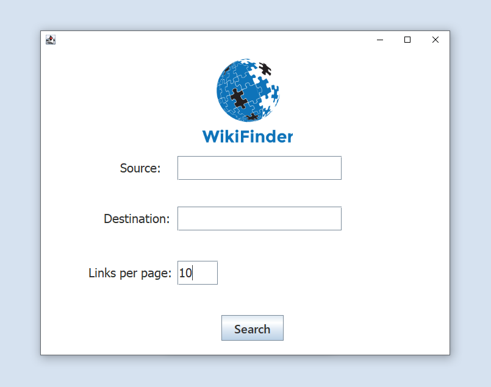

# Wiki Project -  CSIS 2420 Project

## Welcome!

This was a CSIS 2420 project that worked with Java, JSON, the Java 11 HttpClient, and the Wikipedia API.
It uses a graph to chart wikipedia page links that connect two given pages.
